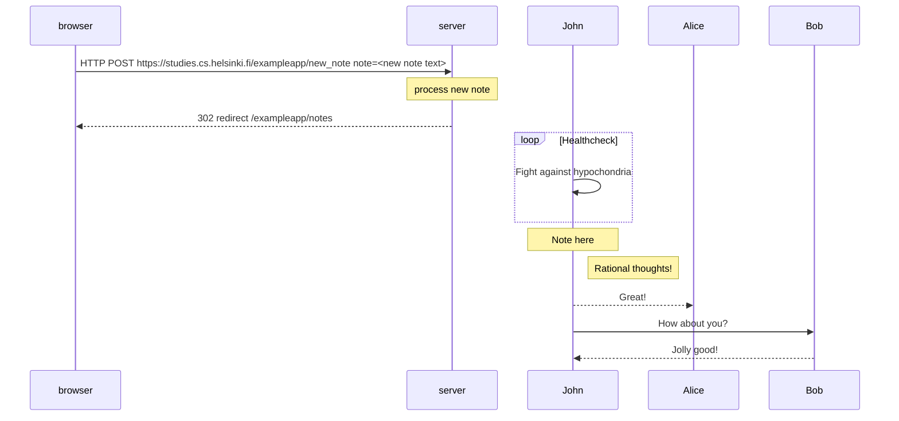

# Note creation flow

```mermaid
sequenceDiagram
browser->>server: HTTP POST https://studies.cs.helsinki.fi/exampleapp/new_note note=<new note text>
Note over server: process new note
server-->>browser: 302 redirect /exampleapp/notes
loop Healthcheck
    John->>John: Fight against hypochondria
end
Note over John: Note here
Note right of John: Rational thoughts!
John-->>Alice: Great!
John->>Bob: How about you?
Bob-->>John: Jolly good!
```
