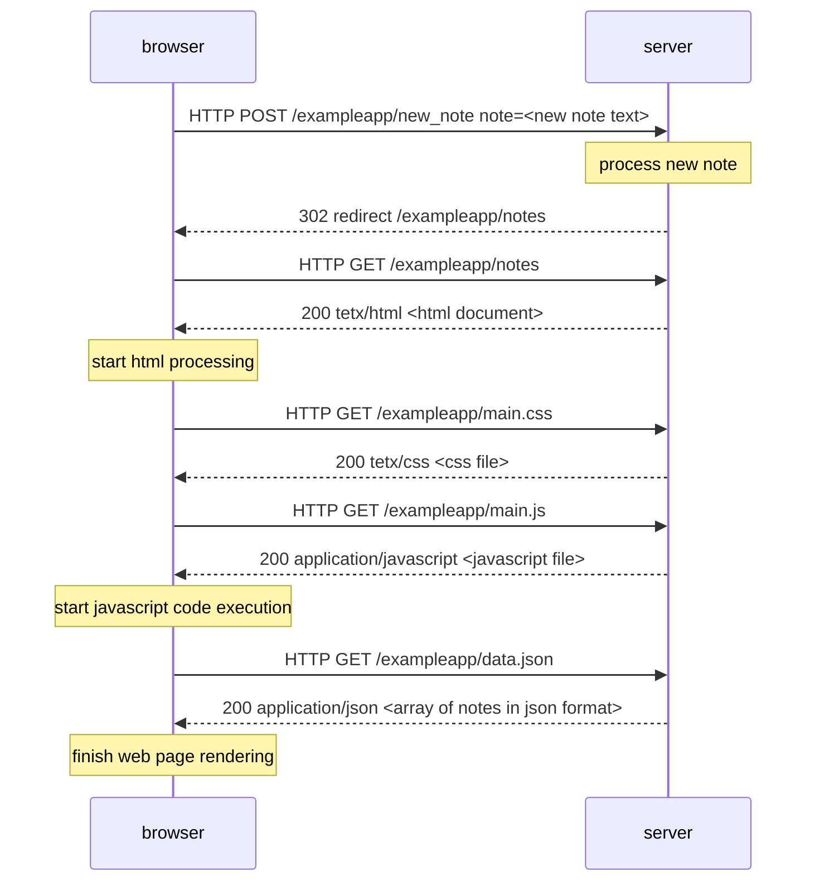

# Note creation flow

Base server URL: https://studies.cs.helsinki.fi

Also browser sends GET request to /favicon.ico, but the site doesn't have an icon,
and server sends back default html document, available by the base URL.
