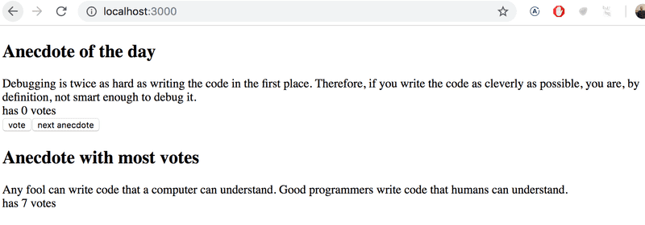

# 1.14*: anecdotes step3

Now implement the final version of the application that displays the anecdote with the largest number of votes:

If multiple anecdotes are tied for first place it is sufficient to just show one of them.

This was the last exercise for this part of the course and it's time to push your code to GitHub and mark all of your finished exercises to the "my submissions" tab of the submission application.