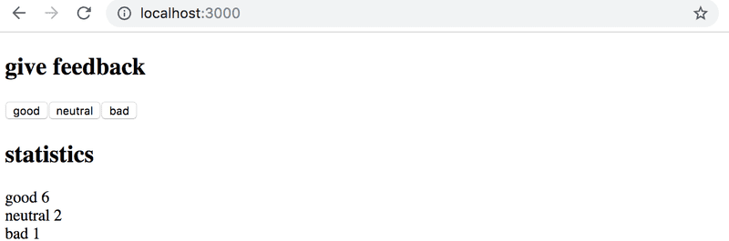

# 1.6: unicafe step1

Like most companies, Unicafe collects feedback from its customers.
Your task is to implement a web application for collecting customer feedback.
There are only three options for feedback: good, neutral, and bad.

The application must display the total number of collected feedback for each category.
Your final application could look like this:

Note that your application needs to work only during a single browser session.
Once you refresh the page, the collected feedback is allowed to disappear.
