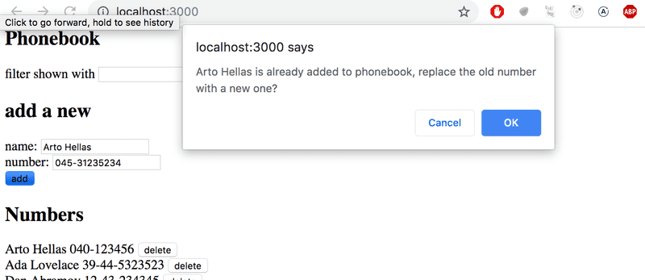

# 2.15*: Phonebook step10

Why is there a star in the exercise? See here for the explanation.

Change the functionality so that if a number is added to an already existing user,
the new number will replace the old number.
It's recommended to use the HTTP PUT method for updating the phone number.

If the person's information is already in the phonebook,
the application can ask the user to confirm the action:

