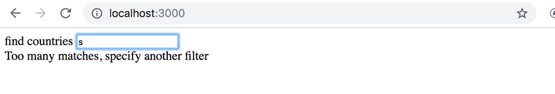
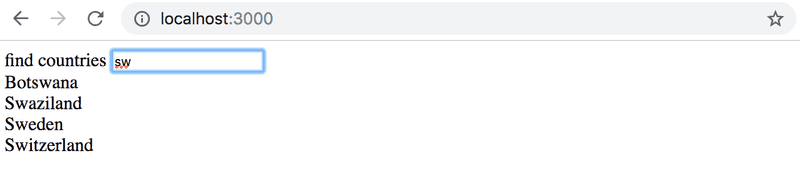

# 2.18* Data for countries, step1

The API https://restcountries.com provides data for different countries in a machine-readable format,
a so-called REST API.

Create an application, in which one can look at data from various countries.
The application should probably get the data from the endpoint [all](https://restcountries.com/v3.1/all).

The user interface is very simple. The country to be shown is found by typing a search query into the search field.

If there are too many (over 10) countries that match the query, then the user is prompted to make their query more specific:

If there are ten or fewer countries, but more than one, then all countries matching the query are shown:

When there is only one country matching the query, then the basic data of the country (eg. capital and area), its flag and the languages spoken are shown:

NB: It is enough that your application works for most countries.
Some countries, like Sudan, can be hard to support since the name of the country is part of the name of another country,
South Sudan. You don't need to worry about these edge cases.
