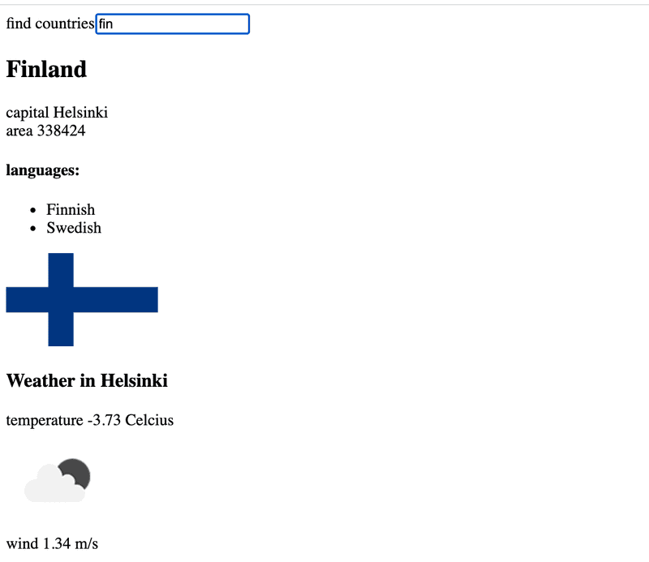

# 2.20*: Data for countries, step3

There is still a lot to do in this part, so don't get stuck on this exercise!

Add to the view showing the data of a single country,
the weather report for the capital of that country.
There are dozens of providers for weather data.
One suggested API is https://openweathermap.org.
Note that it might take some minutes until a generated API key is valid.



If you use Open weather map, [here](https://openweathermap.org/weather-conditions#Icon-list)
is the description for how to get weather icons.

NB: In some browsers (such as Firefox) the chosen API might send an error response,
which indicates that HTTPS encryption is not supported,
although the request URL starts with http://.
This issue can be fixed by completing the exercise using Chrome.

NB: You need an api-key to use almost every weather service.
Do not save the api-key to source control!
Nor hardcode the api-key to your source code.
Instead use an [environment variable](https://create-react-app.dev/docs/adding-custom-environment-variables/)
to save the key.

Assuming the api-key is t0p53cr3t4p1k3yv4lu3, when the application is started like so:

```bash
REACT_APP_API_KEY=t0p53cr3t4p1k3yv4lu3 npm start // For Linux/macOS Bash
($env:REACT_APP_API_KEY="t0p53cr3t4p1k3yv4lu3") -and (npm start) // For Windows PowerShell
set "REACT_APP_API_KEY=t0p53cr3t4p1k3yv4lu3" && npm start // For Windows cmd.exe
```

you can access the value of the key from the process.env object:

```bash
const api_key = process.env.REACT_APP_API_KEY
// variable api_key has now the value set in startup
```

Note that if you created the application using npx create-react-app ...
and you want to use a different name for your environment variable
then the environment variable name must still begin with REACT_APP_.
You can also use a .env file rather than defining it on the command line each time
by creating a file entitled '.env' in the root of the project and adding the following.

```js
# .env
REACT_APP_API_KEY=t0p53cr3t4p1k3yv4lu3
```

Note that you will need to restart the server to apply the changes.

This was the last exercise of this part of the course.
It's time to push your code to GitHub and mark all of your
finished exercises to the exercise submission system.
