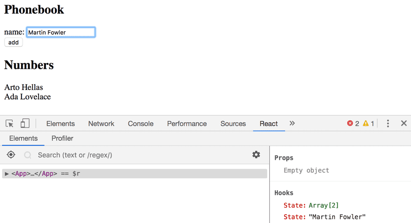

# 2.6: The Phonebook Step1

Let's create a simple phonebook. In this part, we will only be adding names to the phonebook.

Let us start by implementing the addition of a person to the phonebook.

You can use the code below as a starting point for the App component of your application:

```js
import { useState } from 'react'

const App = () => {
  const [persons, setPersons] = useState([
    { name: 'Arto Hellas' }
  ]) 
  const [newName, setNewName] = useState('')

  return (
    <div>
      <h2>Phonebook</h2>
      <form>
        <div>
          name: <input />
        </div>
        <div>
          <button type="submit">add</button>
        </div>
      </form>
      <h2>Numbers</h2>
      ...
    </div>
  )
}

export default App
```

The newName state is meant for controlling the form input element.

Sometimes it can be useful to render state and other variables as text for debugging purposes.
You can temporarily add the following element to the rendered component:

```js
<div>debug: {newName}</div>
```

It's also important to put what we learned in the debugging React
applications chapter of part one into good use.
The React developer tools extension is incredibly useful for tracking
changes that occur in the application's state.

After finishing this exercise your application should look something like this:



Note the use of the React developer tools extension in the picture above!

NB:

- you can use the person's name as a value of the key property
- remember to prevent the default action of submitting HTML forms!
