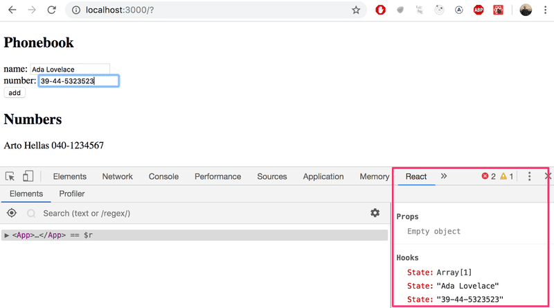

# 2.8: The Phonebook Step3

Expand your application by allowing users to add phone numbers to the phone book.
You will need to add a second input element to the form (along with its own event handler):

```js
<form>
  <div>name: <input /></div>
  <div>number: <input /></div>
  <div><button type="submit">add</button></div>
</form>
```

At this point, the application could look something like this.
The image also displays the application's state with the help of React developer tools:


